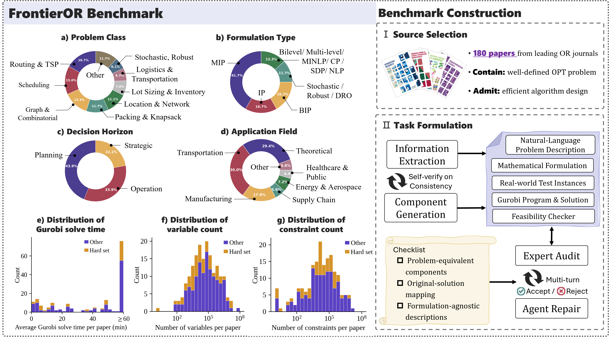

#  FrontierOR: Benchmarking LLMs' Capacity for Efficient Algorithm Design in Large-Scale Optimization

<p align="center">
  <a href="https://frontieror.vercel.app/"></a>
  &nbsp;
  <a href="https://arxiv.org/abs/2605.25246"></a>
  &nbsp;
  <a href="https://huggingface.co/datasets/SmartOR/FrontierOR"></a>
</p>

<p align="center">
  
</p>

<p align="center">

<a href="#-introduction">Introduction</a> · <a href="#-environment-setup">Setup</a> · <a href="#-quick-start">Quick Start</a> · <a href="#-run-evaluation">Evaluation</a> · <a href="#-leaderboard">Leaderboard</a> · <a href="#-adding-support-for-new-models">Submit New Models</a>

</p>

> Overview of the FrontierOR benchmark. FrontierOR spans diverse problem domains, formulation types, and application fields. Each optimization problem involves 10² to 10⁷ decision variables and constraints (median ~10⁴), with Gurobi failing to reach optimality on **46%** of large-scale instances within a one-hour time budget. We construct the benchmark by collecting problems from leading OR journals, and ensure data quality through multi-round expert review.

---

## 📖 Introduction

Large language models (LLMs) are increasingly used for optimization modeling and solver-code generation, yet practical operations research (OR) problems often require a harder capability: designing *scalable algorithms* that exploit problem structure and outperform direct formulation-and-solve baselines. Existing benchmarks are limited to small or simplified examples far below real-world scale and complexity.

We introduce **FrontierOR**, among the first benchmarks to systematically evaluate LLM-based efficient algorithm design for realistic large-scale optimization problems. FrontierOR includes **180 tasks** derived from methodologically diverse papers published in top-tier OR venues, each shipped with:

- A natural-language **problem description**,
- A faithful **mathematical formulation**,
- A standardized suite of **large-scale instances**,
- An expert-verified **Gurobi reference baseline**,
- A standalone **feasibility checker**.

We currently evaluate seven LLMs backbones and three test-time evalution methods and results reveal that frontier models still struggle to move from executable formulations to *efficient* optimization algorithms: the strongest model outperforms Gurobi in only **31%** of cases on both solution quality and computational efficiency, and even strong coding agents with test-time evolution achieve only **50%** on selected hard tasks. FrontierOR thus establishes a practical platform for systematically testing whether future LLMs and agents can move beyond correct formulation toward feasible, high-quality, and *efficient* algorithms.

---

## ⚙️ Environment Setup

### Step 1 — Clone the repo and download the dataset

The code lives on GitHub; the benchmark data is hosted on HuggingFace at [`SmartOR/FrontierOR`](https://huggingface.co/datasets/SmartOR/FrontierOR).

```bash
# 1. Clone the code repo
git clone git@github.com:Minw913/FrontierOR.git
cd FrontierOR

# 2. Download the dataset into ./frontier-or/
pip install -U "huggingface_hub[cli]"
huggingface-cli download SmartOR/FrontierOR --repo-type dataset --local-dir frontier-or
```

### Step 2 — Python environment

We recommend [`uv`](https://github.com/astral-sh/uv) for fast, reproducible installs:

```bash
uv venv --python 3.13 .venv
source .venv/bin/activate
uv pip install -r requirements.txt
```

### Step 3 — Gurobi license

During evaluation some LLM-generated solver programs require a valid `gurobipy` license. Place it at the path pointed to by `GRB_LICENSE_FILE` (the Dockerfile mounts it at `/opt/gurobi/gurobi.lic`).

### Step 4 — OpenRouter API key

LLM calls go through OpenRouter and the model registry is in `configs/oneshot.yaml`. `configs/api_keys.yaml` provides two scoped keys (one-shot generation and test-time self-evolution), allowing each workload to use a separate OpenRouter account or quota:

```yaml
OPENROUTER_API_KEY_ONESHOT: sk-or-...       
OPENROUTER_API_KEY_SELF_EVOLVE: sk-or-...   
```

You do **not** need this for the Quick Start below, which reuses pre-generated code in `samples/`.

---

## 🚀 Quick Start

Run the following command to quickly conduct the one-shot evaluation, with results written to `eval/`. No API key is required, making this the fastest sanity check that the framework is set up correctly.

```bash
python -u one_shot_eval.py --paper_id bierwirth2017 liao2020 --reuse-code all --code-root samples/oneshot_code --exec-mode bare
```

---

## 🧪 Run Evaluation

FrontierOR exposes two evaluation pipelines: **one-shot LLM generation**, and **test-time self-evolution**. You can run FrontierOR in any of three execution backends:

| Backend | What it does | When to use |
|---|---|---|
| `bare` | Runs each LLM-generated code subprocess directly in the host environment, no resource caps. | Local development, fastest startup. |
| `systemd` (default) | Wraps each subprocess in a `systemd-run --scope` unit with pinned CPUs (`AllowedCPUs`) and `MemoryMax`. | Multi-paper parallel runs on a Linux server — reproducible CPU/RAM caps, no Docker. |
| `docker` | Runs each subprocess in a Docker container with `--cpuset-cpus`, `--memory`, and `--network=none`. | Untrusted code, full isolation, or air-gapped reproducibility. Requires building the `frontier-or` image first (`docker build -t frontier-or .`). |

### One-shot LLM generation

Drives the full one-shot pipeline: prompt assembly → LLM code generation → tiny sanity check → large-instance evaluation.

```bash
python -u one_shot_eval.py \
    --models claude-opus-4.6 gpt-5.3-codex \
    --instances tiny large_1 large_2 large_3 large_4 large_5 \
    --max_debug_retries 5 \
    --time_limit 3600 \
    --paper_workers 1 --model_workers 1 --instance_workers 5 \
    --exec-mode systemd
```

Key flags:

- `--paper_id` — paper IDs.
- `--models` — model names registered in `configs/oneshot.yaml`. Pass `all` to evaluate every model in the file.
- `--instances` — instances to evaluater. Put `tiny` first as a sanity gate: stop here if it's not feasible with gap ≤ 10%, before running the computationally expensive large instances.
- `--max_debug_retries` — bounded debug loop when the LLM's program raises.
- `--paper_workers` / `--model_workers` / `--instance_workers` — three-level parallelism across the (paper × model × instance) grid.
- `--exec-mode` — `bare` / `systemd` / `docker`, paired with `--cpus` / `--memory`. Isolation strength: `bare` only pins CPUs; `systemd` adds cgroup-enforced memory cap + network block; `docker` adds full container isolation (no host filesystem access).
- `--reuse-code {none,incomplete,all}` —  `none` always re-generates; `all` skips LLM generation and re-runs evaluation on the existing code

### Test-time Self-evolution

A single CLI wrapper drives all self-evolving frameworks, each starting from the same one-shot-generated code. Defaults match the configurations reported in the paper, you usually only need to choose the framework and papers:

```bash
python -u test_time_self_evolution/run_eval_modes.py \
    --framework openevolve \
    --openevolve-iterations 30 \
    --primary-model gpt-5.3-codex \
    --paper-workers 20 \
    --dev-set median \
    --test-instance-workers 4 \
    --exec-mode systemd \
    --cpus 1 --memory 640G \
    --run-id your_run_id
```

Switch frameworks via `--framework {eoh,coral,openevolve}`; framework-specific knobs (`--eoh-*`, `--coral-*`, `--openevolve-iterations`) override the defaults when needed. The stage1 (binary gate on `tiny`) → stage2 (dev set fitness) → test-set scoring pipeline is shared across all three frameworks for apples-to-apples comparison.

---

## 🏆 Leaderboard

See performance details for **One-shot generation**, **Test-time self-evolution**, and **individual tasks** on the [🌐 FrontierOR website](https://frontieror.vercel.app/).

---

## 🤖 Adding Support for New Models

FrontierOR routes all LLM calls through OpenRouter, so adding a model is a configuration-only change in most cases.

1. **Pick the OpenRouter route** (e.g. `anthropic/claude-opus-4.6`, `openai/gpt-5.3-codex`).
2. **Register a short name and route** in `configs/oneshot.yaml` — copy an existing block and edit the `route`, `short_name`, and any sampling parameters (temperature, max tokens, reasoning effort).
3. **(Optional) Tune the prompt** by editing the `build_prompt()` function in `one_shot_eval.py` if the model has unusual formatting requirements.
4. **Run** `python one_shot_eval.py --paper-id <ID> --models <short_name>` to verify the model's code is parsed correctly.

For self-evolution, the same short name flows through `--primary-model` / `--secondary-model` in `test_time_self_evolution/run_eval_modes.py`.

---

## 📚 Citation

If you use FrontierOR in your research, please cite:

```bibtex
@article{kong2026frontieror,
  title={FrontierOR: Benchmarking LLMs' Capacity for Efficient Algorithm Design in Large-Scale Optimization},
  author={Kong, Minwei and Jiang, Chonghe and Qu, Ao and Ouyang, Wenbin and Zeng, Zhaoming and Guo, Xiaotong and Li, Zhekai and Li, Junyi and Fan, Yi and Zheng, Xinshou and others},
  journal={arXiv preprint arXiv:2605.25246},
  year={2026}
}
```
