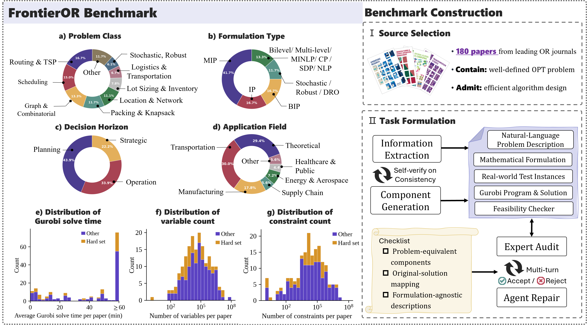

#  FrontierOR: Benchmarking LLMs' Capacity for Efficient Algorithm Design in Large-Scale Optimization

<p align="center">
  <a href="https://www.frontieror.org"></a>
  &nbsp;
  <a href="https://arxiv.org/abs/2605.25246"></a>
  &nbsp;
  <a href="https://huggingface.co/datasets/frontieror/FrontierOR"></a>
</p>

<p align="center">
  <em>For technical questions or collaboration, please contact ✉️ <a href="mailto:contact@frontieror.org">contact@frontieror.org</a></em>
</p>

<div align="center">

<a href="#-introduction">Introduction</a> · <a href="#-environment-setup">Setup</a> · <a href="#-quick-start">Quick Start</a> · <a href="#-run-evaluation">Evaluation</a> · <a href="#-trusted-agent-evaluation">Trusted Agent Evaluation</a> · <a href="#-leaderboard">Leaderboard</a> · <a href="#-adding-support-for-new-models">Submit New Models</a>

</div>

<p align="center">
  
</p>

> Overview of FrontierOR: 180 literature-grounded OR tasks spanning diverse domains and formulations, with 10² to 10⁷ decision variables/constraints and Gurobi failing to reach optimality on **46%** of large-scale instances within one hour.

---

## 📖 Introduction

**FrontierOR** evaluates whether LLMs can move beyond optimization modeling to
design *scalable algorithms* for realistic large-scale OR problems. It contains
**180 literature-grounded tasks** from top-tier OR venues, each with:

- A natural-language **problem description**,
- A faithful **mathematical formulation**,
- A standardized suite of **large-scale instances**,
- An expert-verified **Gurobi reference baseline**,
- A standalone **feasibility checker**.

Across frontier LLM backbones and three test-time evolution methods, models
still struggle to turn executable formulations into efficient algorithms: no
one-shot model beats Gurobi on both quality and solving speed for more than **40%** of
large-scale instances, and strong agent harnesses reach only **50%** on a
selected hard set of 50 tasks.

---

## ✨ News

- <span style="color:#dab167"><strong>[09/27/2026]</strong></span> **FrontierOR-v1 was updated!** This important dataset update consolidates the canonical 180-task collection, Gurobi references, hard-set split metadata, feasibility checkers, and task-instance artifacts. For detailed notes, see [`RELEASE_NOTES.md`](https://huggingface.co/datasets/frontieror/FrontierOR/blob/main/RELEASE_NOTES.md).
- <span style="color:#dab167"><strong>[09/24/2026]</strong></span> FrontierOR was accepted to the NeurIPS 2026 Evaluation & Dataset Track! 🎉
- <span style="color:#dab167"><strong>[08/16/2026]</strong></span> FrontierOR added [`reef-eval`](https://github.com/Human-Agent-Society/tide-eval) orchestration for hardened agents, enabling resumable scheduling, budget tracking, and trace logging on top of the trusted evaluation stack.
- <span style="color:#dab167"><strong>[08/04/2026]</strong></span> FrontierOR introduced the trusted evaluation security infrastructure, including Docker isolation, brokered dev scoring, credential isolation, hidden final grading, and boundary checks.
- <span style="color:#dab167"><strong>[05/30/2026]</strong></span> FrontierOR is publicly live! 180-task benchmark on [Hugging Face](https://huggingface.co/datasets/frontieror/FrontierOR), evaluation harness on [GitHub](https://github.com/Minw913/FrontierOR), leaderboards and per-task results on the [official website](https://www.frontieror.org).
- <span style="color:#dab167"><strong>[05/26/2026]</strong></span> FrontierOR preprint released on [arXiv](https://arxiv.org/abs/2605.25246): the first literature-grounded benchmark targeting LLM-generated algorithm efficiency on realistic large-scale optimization problems.

---

## ⚙️ Environment Setup

### Step 1: Clone the repo and download the dataset

The code lives on GitHub; the benchmark data is hosted on HuggingFace at [`frontieror/FrontierOR`](https://huggingface.co/datasets/frontieror/FrontierOR).

```bash
# 1. Clone the code repo
git clone https://github.com/Minw913/FrontierOR.git
cd FrontierOR

# 2. Download the dataset into ./frontier-or/
pip install -U "huggingface_hub[cli]"
hf download frontieror/FrontierOR --repo-type dataset --local-dir frontier-or
```

The downloaded dataset root contains repository-level files plus
`metadata/paper_meta_info.json`. Per-paper task payloads live under
`frontier-or/tasks/<paper_id>/`.

The Hugging Face dataset includes the consolidated Gurobi baseline at
`frontier-or/metadata/gurobi_references.parquet` (with a portable
`gurobi_references.csv.gz` copy). Evaluation reads the Parquet table by
default; pass `--gurobi-source solutions` to read the per-task solution JSON
files directly.

### Step 2: Python environment

We recommend [`uv`](https://github.com/astral-sh/uv) for fast, reproducible installs:

```bash
uv venv --python 3.13 .venv
source .venv/bin/activate
uv pip install -r requirements.txt
```

### Step 3: Gurobi license

During evaluation some LLM-generated solver programs require a valid `gurobipy` license. Place it at the path pointed to by `GRB_LICENSE_FILE` (the Dockerfile mounts it at `/opt/gurobi/gurobi.lic`).

### Step 4: OpenRouter API key

LLM calls go through OpenRouter and the model registry is in
`configs/oneshot.yaml`. Set `OPENROUTER_API_KEY`, or use a local
`configs/api_keys.yaml`:

```bash
cp configs/api_keys.example.yaml configs/api_keys.yaml
```

```yaml
OPENROUTER_API_KEY_ONESHOT: "<your-one-shot-openrouter-key>"
OPENROUTER_API_KEY_SELF_EVOLVE: "<your-self-evolve-openrouter-key>"
```

---

## 🚀 Quick Start

Run the following command to quickly conduct the one-shot evaluation, with results written to `eval/`. It reuses pre-generated code for one shipped sample, so **no API key is required**, making this the fastest sanity check that the framework is set up correctly.

```bash
python -u one_shot_eval.py \
    --task-plan-json samples/quickstart_task_plan.json \
    --reuse-code all \
    --code-root samples/oneshot_code \
    --exec-mode bare
```

---

## 🧪 Run Evaluation

FrontierOR exposes two evaluation pipelines: **one-shot LLM generation**, and **test-time self-evolution**. You can run FrontierOR in any of three execution backends:

| Backend | What it does | When to use |
|---|---|---|
| `bare` | Runs each LLM-generated code subprocess directly in the host environment, no resource caps. | Local development, fastest startup. |
| `systemd` (default) | Wraps each subprocess in a `systemd-run --scope` unit with pinned CPUs (`AllowedCPUs`) and `MemoryMax`. | Multi-paper parallel runs on a Linux server — reproducible CPU/RAM caps, no Docker. |
| `docker` | Runs each subprocess in a Docker container with `--cpuset-cpus`, `--memory`, and `--network=none`. | Untrusted code, full isolation, or air-gapped reproducibility. Requires building the `frontier-or` image first (`docker build -t frontier-or .`). |

### One-shot LLM generation

Drives the full one-shot pipeline: prompt assembly → LLM code generation → tiny sanity check → large-instance evaluation.

```bash
python -u one_shot_eval.py \
    --paper_id bierwirth2017 liao2020 \
    --models gpt-5.3-codex \
    --instances tiny large_1 large_2 large_3 large_4 large_5 \
    --max_debug_retries 5 \
    --time_limit 3600 \
    --paper_workers 1 --model_workers 1 --instance_workers 5 \
    --exec-mode systemd
```

<details>
<summary>Key flags</summary>

- `--paper_id` — paper IDs. If omitted, the run scans all downloaded tasks.
- `--models` — model names registered in `configs/oneshot.yaml`. Pass `all` to evaluate every model in the file.
- `--instances` — instances to evaluate. Put `tiny` first as a sanity gate, before running the computationally expensive large instances.
- `--max_debug_retries` — bounded debug loop when the LLM's program raises.
- `--paper_workers` / `--model_workers` / `--instance_workers` — three-level parallelism across the (paper × model × instance) grid.
- `--exec-mode` — `bare` / `systemd` / `docker`, paired with `--cpus` / `--memory`. Isolation strength: `bare` only pins CPUs; `systemd` adds cgroup-enforced memory cap + network block; `docker` adds full container isolation (no host filesystem access).
- `--reuse-code {none,incomplete,all}` —  `none` always re-generates; `all` skips LLM generation and re-runs evaluation on the existing code

</details>

Use `scripts/compute_benchmark_main_metrics.py` to compute performance metrics
on the Full and Hard benchmark splits:

```bash
FRONTIER_OR_DATA_DIR="$PWD/frontier-or" \
python scripts/compute_benchmark_main_metrics.py
```

### Test-time Self-evolution

A single CLI wrapper drives all self-evolving frameworks, each starting from the same one-shot-generated code. Install the framework you plan to run with its setup script under `test_time_self_evolution/<framework>/setup.sh`.

```bash
python -u test_time_self_evolution/run_eval_modes.py \
    --modes self_evolve \
    --framework openevolve \
    --paper-id bierwirth2017 liao2020 \
    --primary-model gpt-5.3-codex \
    --openevolve-iterations 30 \
    --paper-workers 2 \
    --test-instance-workers 4 \
    --exec-mode systemd \
    --cpus 1 --memory 100G \
    --run-id openevolve_smoke
```

Switch frameworks via `--framework {eoh,coral,openevolve}`; framework-specific knobs (`--eoh-*`, `--coral-*`, `--openevolve-iterations`) override the defaults when needed. If `--paper-id` is omitted, the run scans all downloaded tasks. If `--dev-set` is omitted, each task uses the large instance with median Gurobi runtime as its dev instance. The stage1 (binary gate on `tiny`) → stage2 (dev set fitness) → test-set scoring pipeline is shared across all three frameworks for apples-to-apples comparison.

For resumable large-scale orchestration with `reef-eval`, see
[`trusted_eval_infra/README.md`](trusted_eval_infra/README.md#reef-eval-orchestration).

---

## 🔒 Trusted Agent Evaluation

Use this entry point when the code-producing Agent or submitted solver is
untrusted. It runs the CORAL agent profile with mandatory Docker isolation,
brokered dev scoring, credential-isolating model access, and hidden final
grading.

```bash
bash test_time_self_evolution/coral/setup.sh
export OPENROUTER_API_KEY="<platform-openrouter-key>"

docker build -f trusted_eval_infra/docker/candidate.Dockerfile \
    -t frontieror-candidate:1 .
docker build -f trusted_eval_infra/docker/agent.Dockerfile \
    -t frontieror-coral-agent:0.1 .
docker build -f trusted_eval_infra/docker/model-proxy.Dockerfile \
    -t frontieror-coral-model-proxy:0.1 .

python -m trusted_eval_infra agent \
    --paper-id bierwirth2017 \
    --primary-model openai/gpt-5.4 \
    --stage1-instances tiny \
    --dev-set large_1 \
    --test-set large_2 \
    --coral-agent-count 1 \
    --coral-attempts 10 \
    --coral-max-steps 10 \
    --coral-max-seconds auto \
    --cpus 1 --memory 128G \
    --run-id agent-smoke
```

Use `run_eval_modes.py` for trusted research runs; use `trusted_eval_infra agent`
for fail-closed evaluation of untrusted agents or submissions. See
[`trusted_eval_infra/README.md`](trusted_eval_infra/README.md) for security
boundaries, proxy mode, hidden-final handling, and complete examples.

Before releasing a runner image, execute the black-box boundary tests:

```bash
python -m trusted_eval_infra security-check \
    --candidate-image frontieror-candidate:1
```

The command probes host-file and environment access, root writes, public
networking, timeout escape, and output flooding in both candidate and checker
containers. The complete architecture, visibility matrix, threat model, WLS
policy, and Code-only verifier are documented in
[`trusted_eval_infra/README.md`](trusted_eval_infra/README.md).

---

## 🏆 Leaderboard

See performance details for **one-shot generation**, **test-time self-evolution**, and **individual tasks** on the [🌐 FrontierOR website](https://www.frontieror.org).

Current evaluation support covers OpenAI, Anthropic, Google, xAI, DeepSeek,
Qwen, Meta Llama, Z.AI, and Moonshot model routes, plus OpenEvolve, EoH, and
CORAL agent frameworks. Contact us to propose additional models or agent
frameworks.

<!-- Key takeaways:

1. **Frontier vs. cost-effective.** Frontier-tier feasibility clusters at 0.60–0.62 on Full and 0.49–0.64 on Hard; cost-effective models sit at 0.18–0.42 and 0.13–0.37 respectively — the gap is preserved at both scales.
2. **Execution is no longer the bottleneck.** GPT-5.3-Codex executes 98% of tasks but still scores only 0.49 feasibility on Hard; the difficulty has shifted from "compiles and runs" to "produces a valid, scalable algorithm".
3. **The Hard subset re-separates leaders.** On Full, the three frontier models are tightly bunched; on Hard the band widens — Claude Opus 4.6 retains the highest QTE (0.31 / 0.32), while GPT-5.3-Codex's Hard feasibility / QTE drop furthest. -->

---

## 🤖 Adding Support for New Models or Agent Frameworks

[2026-10-02] We are preparing a hosted evaluation infrastructure for publicly benchmarking
new model backbones and agent frameworks on FrontierOR. Submission details and
operational guidelines will be announced soon. Stay tuned!

<!-- FrontierOR routes all LLM calls through OpenRouter, so adding a model is a configuration-only change in most cases.

1. **Pick the OpenRouter route** (e.g. `anthropic/claude-opus-4.6`, `openai/gpt-5.3-codex`).
2. **Register a short name and route** in `configs/oneshot.yaml` — copy an existing block and edit the `route`, `short_name`, and any sampling parameters (temperature, max tokens, reasoning effort).
3. **(Optional) Tune the prompt** by editing the `build_prompt()` function in `one_shot_eval.py` if the model has unusual formatting requirements.
4. **Run** `python one_shot_eval.py --paper-id <ID> --models <short_name>` to verify the model's code is parsed correctly.

For self-evolution, the same short name flows through `--primary-model` / `--secondary-model` in `test_time_self_evolution/run_eval_modes.py`. -->

---

## 📚 Citation

If you find FrontierOR useful, please consider giving us a ⭐ Star and/or citing it in your work:

```bibtex
@article{kong2026frontieror,
  title={FrontierOR: Benchmarking LLMs' Capacity for Efficient Algorithm Design in Large-Scale Optimization},
  author={Kong, Minwei and Jiang, Chonghe and Qu, Ao and Ouyang, Wenbin and Zeng, Zhaoming and Guo, Xiaotong and Li, Zhekai and Li, Junyi and Fan, Yi and Zheng, Xinshou and others},
  journal={arXiv preprint arXiv:2605.25246},
  year={2026}
}
```
